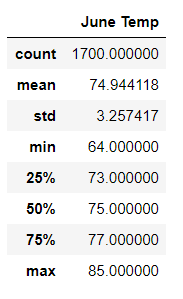
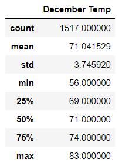

# Surfs_up
 

## Overview:
We are looking to open up a surf&serve shop in Hawaii; an analysis on weather is done to show the investor that this is a good business idea.

## Result:
3 differences in weather between June and December is as below:
1. The average temperature in June is 74.9°F while its 71.0°F in December
2. The highest temperature in June is 85.0°F while its 83.0°F in December
3. The lowest temperature in June is 64.0°F while its 56.0°F in December
4. The temperature data more widely spread in December than in June (std 3.75 VS std 3.26)

 
 

## Summary:
There are many factors other than just temperature that might affect people's willingness to surf thus our profitability of the business. As a result, we could do another query on precipitation in June and December. My hypothesis is that people are less willing to surf in a raining day.
Although its not included in our dataset but we could also gather the weather information like cloudiness and wind speed and analyze these two additional factors that may affect surfing Lastly, another analysis can be done on the possibility of volcano eruptions as this may greatly affect our business.

